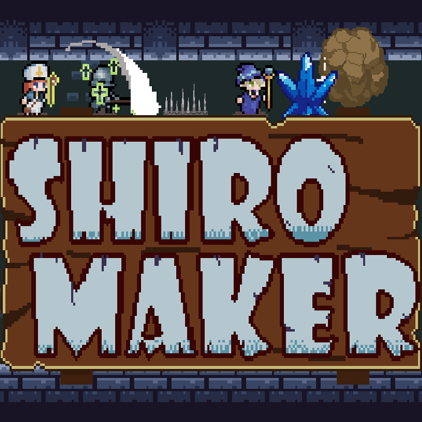

# SHIRO MAKER

侵攻してくる勇者たちを罠で迎え撃つパズルゲーム。 
勇者と罠の特徴を見極め、最適な罠を配置して魔王さまを守り抜こう。

## プレイ

[unityroom でプレイする](https://unityroom.com/games/shiromaker)

## ゲームの流れ

1. **準備フェーズ**で、マップ上に罠を配置する。
2. **侵攻フェーズ**で、戦士・魔法使い・僧侶の勇者たちが城へ進軍する。
3. 罠を活用して勇者たちを全滅させるとステージクリアとなる。
4. 失敗した場合は、配置を見直してリトライできる。

## 特徴

- トゲ・落とし穴・転がる岩などを使った罠の配置
- 戦士、魔法使い、僧侶それぞれの行動に応じた攻略
- 罠を置き直せる準備フェーズと、配置結果を見届ける侵攻フェーズ
- ステージごとに異なる勇者編成と罠の所持数
- 会話、タイトル、結果表示を含むゲーム進行

## 実装ポイント

### フェーズを分けたゲーム進行

タイトル、会話、準備、侵攻、結果、巻き戻しをゲームフェーズとして管理している。
各フェーズでUIや操作対象を切り替え、罠を考える時間と結果を確認する時間を明確に分けた。

### グリッドに沿った罠配置

配置可能なマス、罠ごとの配置ルール、設置済みオブジェクトを個別に管理している。
重複配置を防ぎつつ、設置した罠を戻して戦略を組み直せるようにした。

### データで組み立てるステージ

勇者の種類・HP・出現位置、罠の所持数、初期配置などをデータとして定義している。
ステージを追加・調整する際に、ゲーム進行のコードを大きく変更せずに済む構成とした。

### リトライ時の状態復元

侵攻開始前の状態を保持し、失敗後には罠の配置を維持したまま再挑戦できる。
試行錯誤しながら攻略法を見つけられるようにした。

## 開発環境

- Unity 6.1.8f1
- C#
- Universal Render Pipeline (URP)
- Unity Input System
- TextMesh Pro
- DOTween

## 開発期間・制作体制

- 開発期間: 1週間
- 制作人数: 個人制作
- 担当: 企画、設計、実装、UI制作、素材選定・組み込み、デバッグ

1週間で制作する企画として、まず遊べるゲームループを成立させることを優先した。
そのうえで、罠の配置と勇者の侵攻を軸に、短時間でも試行錯誤を楽しめるゲーム性を目指した。

## AI利用について

短期間での制作を目的に、設計相談、実装、コード整理、デバッグ、ドキュメント作成など、開発工程全体でAIを積極的に活用した。
ゲーム仕様の決定、Unity上での組み込み、動作確認、最終的な採用判断は制作者が行った。

画像・音声などのアセット生成にAIは使用していない。使用しているアセットは自作、または配布元の利用規約に従って利用している。
